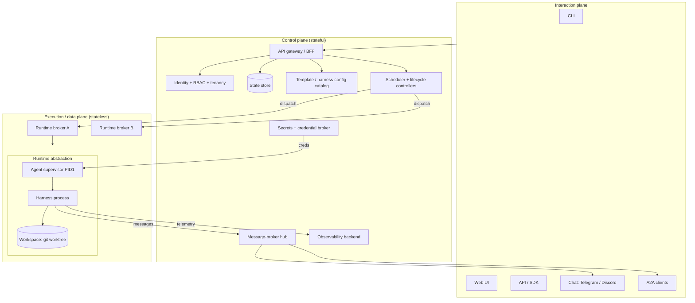
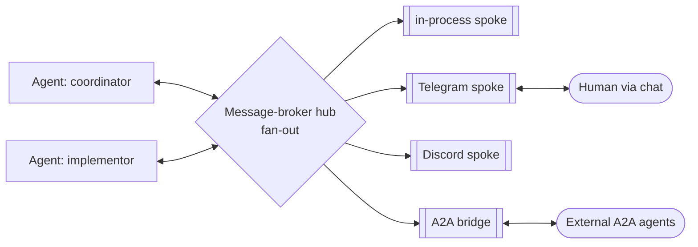
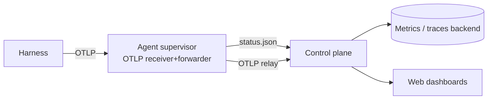
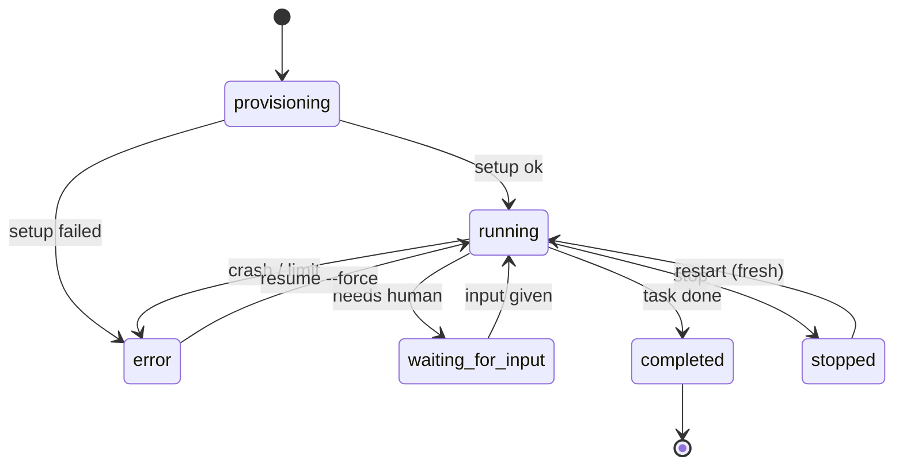

# Референс-архитектура облачного оркестратора агентов

> Инженерная спецификация «как должна выглядеть облачная платформа оркестрации LLM-агентов».
> Изложение вендор-нейтральное; **scion** используется как сквозной рабочий пример каждого компонента.
> В конце - оценка зрелости scion относительно эталона и таблица «есть сейчас / появится скоро».

**Статус:** черновик v1 (ожидается итеративная правка).
**Аудитория:** инженеры и архитекторы платформы.

---

## Тезис

LLM-харнесы (Claude Code, Gemini CLI, Codex, opencode и др.) - это мощные, но **одиночные, локальные, интерактивные** инструменты: один пользователь, локальная файловая система, один сеанс, локальные креды. Чтобы запускать **много** таких агентов **параллельно**, для **многих** пользователей, **безопасно**, на общей облачной инфраструктуре, с человеком-в-контуре и отказоустойчивостью - нужна платформа ВОКРУГ харнеса.

Облачный оркестратор трактует харнес как **сменного воркера** и добавляет всё, что делает систему серверной: control plane, долговременное состояние, многопользовательность, изолированное удалённое исполнение, асинхронный messaging, observability и управление жизненным циклом.

Дальше - эта платформа по слоям, с scion как примером, с оценкой зрелости и разделами про масштабирование/стоимость.

---

## 0. Врезка (контекст, не цель документа): почему платформа, а не набор CLI

Это вспомогательная заметка - почему взять готовый оркестратор проще, чем собирать своё поверх доступных локальных утилит.

- **Харнес != платформа.** Claude Code, Gemini CLI, Codex, Copilot, opencode - это харнесы: один пользователь, локальная ФС, один интерактивный сеанс, локальные креды. Ни многопользовательности, ни серверного состояния, ни изоляции между запусками, ни асинхронной шины, ни observability на флот.
- **Локальные «мультиплексоры»** (Conductor, Vibe Kanban, git-worktree-обвязки) решают локальную версию: несколько агентов в worktree-ветках на твоей машине. Но как только нужны многопользовательность, удалённое исполнение, долговременное состояние, RBAC, секреты, messaging и observability - ты уже строишь распределённый control plane. Это и есть трудная, **харнес-агностичная** часть.
- **scion уже является такой платформой** и харнес-подключаемый: Claude - лишь один из (Gemini, Codex, Copilot, opencode, hermes...). Взять scion = получить control plane «бесплатно» и подключить нужный харнес, вместо того чтобы переизобретать оркестрацию поверх одного вендора.

Остальной документ - про эталонную архитектуру как таковую.

---

## 1. Клиент -> сервер: что превращает агентный CLI в платформу

Главная инверсия: на клиенте **человек** синхронно ведёт **одного** агента; на сервере **платформа** асинхронно надзирает за **многими** агентами, а человек вмешивается по необходимости.

| Забота | Клиентский CLI (напр. Claude Code) | Серверный оркестратор |
|---|---|---|
| Идентичность | Локальный API-ключ / OAuth одного юзера | Федеративный вход (OAuth/SSO), много юзеров |
| Место исполнения | Твой ноутбук, твоя shell/ФС | Headless-воркер в изолированном удалённом окружении |
| Конкурентность | Один сеанс | Десятки-сотни агентов параллельно |
| Изоляция | Нет (всё в твоей среде) | Per-agent контейнер/pod/VM + per-agent workspace |
| Состояние | Эфемерное, в памяти процесса | Долговременное, в control-plane сторе |
| Креды | Лежат локально | Брокерятся платформой, без долгоживущих секретов в образах |
| Взаимодействие | Живой TTY, ты смотришь | Detach по умолчанию + attach/human-in-the-loop по требованию |
| Observability | stdout в терминал | Структурные логи + метрики + трейсы на весь флот |
| Отказ | Ты перезапускаешь вручную | Heartbeat/reaper + durable execution + resume |
| Мультитенантность | Отсутствует | Первичная (проекты, роли, изоляция данных) |

Харнес в серверной модели остаётся тем же процессом, но запускается **под супервизором** (PID1), без TTY, с инъецированными конфигом/скиллами/кредами, а его статус и телеметрия утекают в control plane.

---

## 2. Референс-архитектура: три плоскости

Аналогия: как Kubernetes для контейнеров - control plane управляет, узлы исполняют.

- **Control plane (мозг, stateful).** Владеет истиной: идентичность, состояние, каталог шаблонов, секреты, планирование, шина, observability. Сами API-серверы желательно **stateless** (состояние - в сторе), чтобы масштабироваться горизонтально.
- **Execution / data plane (руки, stateless).** Runtime-брокеры - вычислительные узлы, регистрирующиеся в хабе и исполняющие агентов через runtime-абстракцию (Docker / K8s pod / VM / сторонний сэндбокс). Внутри каждого агента - супервизор PID1, который оборачивает харнес.
- **Interaction plane.** Клиенты и каналы: CLI, web, API/SDK, чат-мессенджеры, A2A. Attach для human-in-the-loop.

**scion:** hub = control plane; runtime broker + `sciontool` (PID1) = execution plane; CLI / web / Telegram-плагин = interaction plane. Hub и broker могут работать в одном процессе (combo) или раздельно; broker держит **исходящий** websocket к хабу (узлу не нужны входящие порты).

**Полезная референс-форма (LangGraph Platform):** stateless **API-серверы** (принимают запросы, но не исполняют агента) + **queue-воркеры** (движок исполнения) + БД-персистенция + очередь задач. scion соответствует этой форме: хаб принимает и хранит, брокер исполняет.

---

## 3. Доменная модель и примитивы

| Примитив | Роль | scion | Аналог в LangGraph |
|---|---|---|---|
| Tenant / Project | Единица владения и изоляции | Project (group) | (namespace) |
| Template / Harness-config | Блюпринт: образ, харнес, auth, роль/персона | template + harness-config | Assistant |
| Agent | Долгоживущий инстанс-воркер | Agent | Thread |
| Run / Session | Одна инвокация харнеса | run (сессия харнеса) | Run |
| Workspace | Изолированная ФС, которую правит агент | git worktree + feature-branch | (checkpoint state) |
| Broker | Вычислительный провайдер для тенантов | Runtime broker | (queue worker pool) |
| Topic | Пространство имён асинхронных сообщений | `scion.project.<id>...` | (streaming channel) |
| Checkpoint | Снимок состояния для resume | (частично, см. §7) | Checkpoint |

Ключ к чистоте: один граф/шаблон обслуживает многих юзеров, но **каждый агент/thread имеет изолированное состояние, историю и рабочую директорию**.

---

## 4. Мультитенантность (серверная забота №1)

- **Идентичность - федеративная.** Юзеры входят в control plane через OAuth/SSO, а не через локальные ключи. Внешние вызовы (API/SDK/A2A) - через per-user access-токены.
- **Авторизация - двухуровневая.** Глобальные роли (admin / member / viewer) + пер-тенантные роли (owner / admin / member). Отдельный вопрос - **источник истины роли/настроек** при нескольких слоях конфигурации (env / БД / UI).
- **Изоляция по осям:** данные (все запросы скоупятся тенантом), исполнение (namespace / узел), workspace (per-agent worktree), секреты (скоуп тенант/агент), сеть (network policy).
- **Брокеринг кредов - без долгоживущих секретов в образах.** Платформа выдаёт агенту облачные/API-креды на лету: перехват metadata-эндпоинта + обмен на токен через хаб, либо workload identity. Долгоживущие ключи в образе - анти-паттерн.

**scion:** роли `admin/member/viewer` (глобально) + `owner/admin/member` (в проекте); глобальный admin задаётся списком `admin_emails`. GCP-identity брокерится per-pod через metadata-interception в `sciontool` + токен-эндпоинт хаба; долгоживущих SA-ключей в образах нет.
**Зрелость:** ✅ tenancy, RBAC, изоляция, credential-брокеринг. 🟡 источник истины настроек между слоями (#446/#438). 🟡 изоляция исполнения на общем namespace (per-project - открытый вопрос).

---

## 5. Message broker (серверная забота №2)

Агенты асинхронны и долгоживущи, поэтому нужна шина для четырёх сценариев:
1. **агент <-> агент** (координатор раздаёт задачи исполнителям);
2. **человек-в-контуре** (агент спрашивает - человек отвечает из чата);
3. **нотификации** (статус/результат -> пользователю);
4. **кросс-платформенный охват** (мессенджеры, внешние агентные экосистемы).

**Архитектура:** хаб-side брокер с **fan-out на несколько spokes**: in-process (для агент<->агент), внешние адаптеры (Telegram, Discord), протокол-мост (A2A). Топики скоупятся тенантом/агентом/юзером. Spokes выносятся в отдельные процессы (напр. hashicorp go-plugin), чтобы падение адаптера не роняло хаб.

**Семантика доставки:** at-least-once с идемпотентностью; **контракт топиков** должен совпадать у хаба и плагинов - версионировать их согласованно.

**A2A (Agent-to-Agent):** отдельный **мост**, экспонирующий агентов платформы как стандартные A2A-эндпоинты (Agent Card, JSON-RPC, SSE/webhook), чтобы внешние агентные системы могли их вызывать. Это НЕ то же, что мессенджер-spoke: мессенджер - канал человек<->агент, A2A - интероп агент<->агент.

**scion:** message broker с fan-out, in-process + Telegram (go-plugin, poll-режим), топики `scion.project.<id>.agent.<slug>.messages` и т.п.; A2A-мост в `extras/scion-a2a-bridge` (отдельный модуль/бинарь, per-user auth hubUAT/hubJWT).
**Зрелость:** ✅ fan-out, in-process, Telegram, топик-скоупинг. 🟡 A2A-мост есть, но требует настройки для prod (#350).

---

## 6. Логи и observability (серверная забота №3)

Три сигнала: **логи, метрики, трейсы**. Для агентов есть отдельный словарь - **OpenTelemetry GenAI semantic conventions** (спаны agent / workflow / tool / model + метрики токенов и латентности), делающий телеметрию сравнимой между вендорами.

**Топология телеметрии:** харнес эмитит OTLP -> супервизор агента принимает и форвардит -> хаб принимает -> backend (Prometheus/Grafana/Cloud Monitoring). Супервизор в цепочке потому, что харнес не знает адрес backend'а - платформа его инъецирует и релеит (заодно добавляя tenant/agent/run-корреляцию).

- **Статус-модель.** Машиночитаемый статус агента (starting / thinking / executing / waiting-for-input / completed / error) отдаётся в control plane - для UI и для control loops.
- **Eval-слой.** Телеметрия != качество. Отдельный слой оценивает выходы (faithfulness, safety, policy). Для большинства платформ - forward-looking.
- **Дисциплина логов.** Корреляция по tenant/agent/run ID; редакция секретов; retention.

**scion:** `sciontool` держит OTLP-ресивер+форвардер; статус пишется в `.<harness>-status.json`; хаб экспонирует `/metrics`.
**Зрелость:** ✅ OTLP-релей, статус-модель, hub-метрики. 🟡 доставка метрик в backend в доработке (#238/#241). 🔴 eval-слой отсутствует.

---

## 7. Мониторинг, control loops и durability (серверная забота №4)

- **Health.** Liveness/readiness хаба и брокеров; **heartbeat** от агентов и брокеров; **reaper-паттерн**: heartbeat-timeout -> пометить stalled/error; sweep застрявших сообщений.
- **Стейт-машина жизненного цикла.**

- **Durable execution - фундамент отказоустойчивости.** Модель checkpoint -> replay -> resume (Temporal / Restate / DBOS / LangGraph). Зачем: вытеснение узла посреди работы не должно терять сессию. Восстановление бывает двух видов: **resume с сохранением сессии** (продолжить прерванную) vs **restart с чистой сессией**. Отдельный аффорданс - восстановление из фазы error (напр. `resume --force`).
- **Backpressure и конкурентность.** Лизинг «1 run на thread» (LangGraph), очереди, честное планирование между тенантами.

**scion:** фазы агента + heartbeat-timeout reaper + stuck-message sweep; `resume` (и `resume --force` для восстановления упавших из error, напр. после вытеснения узла). Полноценного replay-движка нет - resume опирается на сохранённую сессию харнеса, а не на детерминированный реплей истории.
**Зрелость:** ✅ фазы, heartbeat/reaper, resume, crash-recovery. 🟡 durable execution - не Temporal-класса (нет event-replay/exactly-once); достаточно для «продолжить сессию», но не для детерминированного восстановления произвольного шага.

---

## 8. Исполнение, рантайм, изоляция, безопасность (серверная забота №5)

- **Runtime-абстракция.** Подключаемые бэкенды за единым интерфейсом (launch/stop/exec/status): Docker, K8s pod, микро-VM, сторонний сэндбокс.
- **Спектр изоляции.** Shared-kernel контейнеры -> gVisor/Kata -> Firecracker microVM. Недоверенный агентский код аргументирует в пользу более сильной изоляции.
- **Стратегия workspace.** Per-agent **git worktree + feature-branch** (нет конфликтов между агентами); общие директории - через сетевую ФС при необходимости.
- **Провижининг и супервизор.** Материализация образа + шаблона; PID1-супервизор поднимает home, инъецирует конфиг/скиллы/креды, гоняет **pre-start hooks**, запускает харнес, ведёт сайдкары, релеит телеметрию.
- **Безопасность.** Hardened non-root контейнеры, per-agent секреты, network policy, credential-брокеринг (без долгоживущих ключей), supply-chain (провенанс образов). Hardened non-root окружение требует явной настройки прав на workspace для git-операций.

**scion:** runtime-абстракция (Docker / K8s / Apple VZ); workspace = git worktree на `../.scion_worktrees/...`; `sciontool` как PID1 (setup home, инъекция, pre-start hooks, сайдкары, телеметрия); hardened-поды + GCP-identity-брокеринг; workspace-бэкенды local/nfs/gke_shared_volume.
**Зрелость:** ✅ мульти-runtime, worktree-изоляция, супервизор, hardened+брокеринг, pre-start hooks (project- и hub-scoped). 🟡 сильная изоляция недоверенного кода (gVisor/Firecracker) - не задействована по умолчанию.

---

## 9. Масштабирование и стоимость

**Оси масштаба:** число одновременных агентов; число тенантов; число брокеров/регионов; пропускная способность control plane; размер стора состояния; объём телеметрии.

**Горизонтальное масштабирование:**
- **API-серверы stateless** -> масштабируются за балансировщиком.
- **Исполнение** масштабируется добавлением брокеров/узлов и автоскейлом подов.
- **Стор состояния - вертикальное бутылочное горло**: SQLite -> Postgres -> HA-Postgres. Переход на серверную БД часто триггерит и другие требования (HA, бэкапы).
- **Мульти-регион / мульти-клауд:** брокеры как **исходяще-подключающиеся** узлы позволяют ставить исполнение ближе к данным или в VPC заказчика (BYOC). Кросс-клауд-трение: зеркалирование образов между реестрами и брокеринг identity.

**Драйверы стоимости (по убыванию типичного веса):**
1. **Токены LLM** - обычно доминируют (вызовы модели харнесом).
2. **Компьют агентских контейнеров** - враг здесь **idle-время** долгоживущих агентов.
3. **Control plane + стор + хранение телеметрии.**
4. **Egress** (особенно кросс-клауд/кросс-регион).

**Рычаги экономии:**
- Right-size + автоскейл + **reaper простаивающих агентов**.
- **Эфемерные vs персистентные** агенты: персистентные удобно attach'ить, но платишь за простой; эфемерные дешевле, но теряют «живой» сеанс.
- **Warm-пулы vs cold start** (латентность против стоимости простоя).
- **Роутинг моделей / алиасы** - дешёвая модель на дешёвых шагах.
- **Сэмплирование телеметрии.**
- **Spot/preemptible-узлы** - но только вместе с durable execution/resume, чтобы переживать вытеснение.

**Напряжение idle-стоимости:** оркестраторы, спроектированные под **персистентных, attach'абельных** агентов, платят за простой; сэндбокс-примитивы (E2B/Modal/Daytona) оптимизированы под **суб-секундные эфемерные**. Зрелый оркестратор нуждается в lifecycle-reaper и опциональном эфемерном режиме.

**scion:** брокеры - исходящий websocket (BYOC-дружелюбно); агенты **персистентные** (напр. помесячно за под) -> **idle-стоимость реальна**, warm-пулов нет, вытеснение переживается через resume. Стор - SQLite (переход на Postgres/HA - на роадмапе). Модель-алиасы есть.
**Зрелость:** ✅ горизонтальный execution-скейл, BYOC-брокеры, модель-алиасы. 🟡 idle-reaper/эфемерный режим отсутствует. 🟡 стор упирается в SQLite (HA-путь - на роадмапе).

---

## 10. Оценка зрелости: scion относительно эталона

Легенда: ✅ есть · 🟡 частично / с оговоркой · 🔴 нет · ◆ иначе, чем в эталоне.

| Способность | Ожидание эталона | scion | Заметка |
|---|---|:--:|---|
| Control/data plane split | Разделены; API stateless | ✅ | hub + broker (в т.ч. combo) |
| Мультитенантность | Проекты + изоляция данных | ✅ | project = tenant |
| Идентичность | Федеративная OAuth/SSO | ✅ | OAuth + per-user токены |
| RBAC | Глобальные + пер-тенантные роли | 🟡 | источник истины настроек (#446/#438) |
| Изоляция исполнения | Namespace/узел на тенанта | 🟡 | общий namespace; per-project - открытый вопрос |
| Credential-брокеринг | Без долгоживущих ключей | ✅ | GCP-identity per-pod |
| Message broker | Fan-out, human-in-loop | ✅ | in-process + Telegram |
| A2A-интероп | Экспон. агентов по стандарту | 🟡 | мост есть, prod-hardening (#350) |
| Логи/трейсы | OTel GenAI semconv | 🟡 | релей есть; доводка пайплайна метрик (#238/#241) |
| Eval-слой | Оценка качества выходов | 🔴 | отсутствует |
| Health/reaper | Heartbeat + reaper | ✅ | timeout + sweep |
| Durable execution | Checkpoint/replay/resume | 🟡 | resume есть; не Temporal-класса |
| Crash-recovery | Восстановление из error | ✅ | `resume --force` |
| Runtime-абстракция | Плагинные бэкенды | ✅ | Docker/K8s/Apple |
| Изоляция workspace | Per-agent | ✅ | git worktree |
| Сильная изоляция кода | gVisor/Firecracker | 🟡 | не по умолчанию |
| Горизонт. масштаб | Stateless API + узлы | ✅ | брокеры добавляемы |
| Стор под HA | Postgres/HA | 🟡 | SQLite; Postgres/HA на роадмапе |
| Idle-стоимость | Reaper/эфемерный режим | 🟡 | агенты персистентны |
| Мульти-регион/BYOC | Исходящие брокеры | ✅ | outbound-ws + HMAC |

**Вывод:** scion уверенно находится в классе «облачный оркестратор агентов» - control plane, execution plane, tenancy, messaging, observability, lifecycle и resume уже есть. Основные gap'ы: eval-слой (нет), durable execution не детерминированного replay-класса, idle-стоимость персистентных агентов, HA-стор, сильная изоляция недоверенного кода по умолчанию.

---

## 11. Что уже есть в scion / что появится скоро

> Источник: **scion roadmap board** (экспорт `scion-roadmap.tsv`, 2026-07-30, ~190 пунктов). Статусы: In Progress / Todo / Done / Blocked; приоритеты P0-P2. Ниже - курированная выборка архитектурно-значимых пунктов (в основном P0/P1 и In Progress), сгруппированная по заботам документа.

### 11.1 Уже есть (стабильно / недавно завершено)

| Способность | Недавно закрытые пункты роадмапа (Done) |
|---|---|
| Hub + runtime broker (combo и раздельно) | #411 fix 422 no_runtime_broker при редеплое; #419 не пробовать Docker в hosted-режиме |
| Многопользовательность, проекты, RBAC | #418 env-маппер camelCase-полей |
| Runtime: Docker / K8s / Apple VZ; workspace = git worktree | #417 очистка root-owned `__pycache__` после delete |
| Message broker: in-process + Telegram (+ вложения) | **#78 Telegram-вложения (Done)** |
| Harness-config (harness-агностично), модель-алиасы | #414 harness/claude `project_instructions` для native-режима |
| OTLP-релей, статус-модель, heartbeat/reaper, `resume` (+`--force`) | Pre-start hooks (project + hub-scoped), gh://-кэш, платформенные скиллы, Ent ORM - заехали в потоке коммитов |
| GCP-identity брокеринг (per-pod), BYOC-брокеры (outbound-ws + HMAC) | - |

### 11.2 Появится скоро (по roadmap, сгруппировано по заботам §4-9)

| Забота документа | Пункты роадмапа (issue# · статус/приоритет) |
|---|---|
| **§4 Мультитенантность / authz** | #335 инвест в multi-user authz (P1) · #482 tiered agent-роли + наследование scope сабагентов (P1) · #399 OIDC ID-токены для агентов (P1) · #302 rate limiting и квоты на проект/хаб (P1) · #446 single-mutable-store precedence: DB > env/yaml (P1) · #438 layer-aware admin-UI: Layer 0 read-only / Layer 1 editable (P1) |
| **§5 Message broker / интеграции** | **#342 A2A protocol support (P1)** · #350 hardening A2A-моста для prod (P1) · #405 Discord multi-server · #304 per-agent inbound webhooks · #303 secure port-forwarding через хаб · #304... · #38/#579 управление подписками на нотификации |
| **§6 Логи / observability / диагностика** | #360/#514 единый diagnostics-дашборд + агрегация логов hub+broker+agent (P1) · **#358 `scion doctor` (P1)** · #336 better health monitoring + alerts (P1) · #333 better telemetry & cost management (P1) · #238 OTel-рекордеры → Cloud Monitoring (**In Progress**) · #241 metrics pipeline health (**In Progress**) · #355 CPU/mem/disk-метрики на страницах агентов · #346 extraction message-delivery + delivery-observability |
| **§7 Durability / HA / масштаб** | #392 hub-идентификатор вместо hostname для HA (P1) · #291 Cloud Scheduler как HA-бэкенд планировщика (P1) · #362 Telegram PG-стор + HA (P1) · #368 sizing пула соединений для HA (P1) · #367 конфигурируемый интервал/конкурентность планировщика (P1) · **#252 broker capacity limits + live-репортинг для умного планирования (P1)** · #332 Deploy to Cloud Run (P1) · #194 **ephemeral-флаг: авто-очистка агента по завершении (P2)** |
| **§8 Исполнение / runtime / изоляция** | #158 worktree-per-agent для hub-managed workspace (P1) · #523 in-place конвертация workspace-mode · #86 restricted pod security defaults для k8s-подов · #340/#481 Substrate как runtime-тип · #331 запуск сервера в контейнере · #325 Google Secret Manager для стейджинга секретов · #493 network credential proxy с HTTP-rewrite |
| **Harness / модели / SDK** | **#338 pluggable harness (umbrella, P1)** · **#24 официальные Python/TS SDK (P1)** · #247 AWS Bedrock для Claude-харнеса · #183 локальные модели (ollama/llama-cpp/vllm) · #42 template-level алиасы размера модели (small/medium/large) · #403 OTel-экспорт для Copilot CLI |
| **Eval / качество** | **#30 Harness Evaluation Workflow System** (закрывает 🔴 из §6) |
| **Lifecycle hooks** | #35 / #213 configurable agent lifecycle hooks (P1) - реализуется (pre-start hooks уже заехали) |
| **Managed agents / платформа** | #339 Managed agents · #371 `/v1beta/agents` endpoint (P1) · #211 авто-регистрация агентов в Gemini Enterprise · #337 agent platform integrations |
| **Дистрибуция / onboarding** | #31 Homebrew-дистрибуция CLI (**In Progress**, P0) · #327 single-user mode (P1) · #332 Cloud Run · #72 workstation-mode UX (In Progress) · #234 Skill Bank M1 (In Progress, P1) |

### 11.3 Дорожная карта закрывает gap'ы из §10

Прямое подтверждение: почти каждый выявленный пробел уже в плане.

| Gap (§10) | Пункт(ы) роадмапа |
|---|---|
| Eval-слой 🔴 | #30 Harness Evaluation Workflow System |
| Доставка метрик в backend 🟡 | #238 (In Progress), #241 (In Progress), #333 |
| Durable/HA-стор 🟡 | #392, #362, #368, #291 (HA-designation, PG-стор, пулы, HA-планировщик) |
| Idle-стоимость 🟡 | #194 ephemeral-агенты (авто-очистка по завершении) |
| Источник истины настроек (env vs DB/UI) 🟡 | #446 (DB > env/yaml), #438 (layer-aware UI), #147 (settings теряются при рестарте пода) |
| Multi-user authz 🟡 | #335, #482, #399 |
| A2A-интероп (prod-hardening) 🟡 | #342 (support), #350 (prod-hardening) |
| Сильная изоляция кода 🟡 | #86 restricted pod security defaults |
| Мониторинг: единый лог-дашборд | #360/#514, #358 `scion doctor`, #336 alerts |
| Idle/масштаб планирования | #252 broker capacity + live-репортинг |

**Не найдено явно на board:** per-project k8s-namespace изоляция (из §4/§10 - открытый вопрос; ближайшее родственное #158 worktree-per-agent и #86 pod-security).

---

## 12. Принципы

- **Stateless-воркеры / durable-состояние в control plane** - воркер можно потерять и пересоздать.
- **Изоляция по умолчанию** - каждый агент в своём окружении и workspace.
- **Observability-first** - корреляция по tenant/agent/run с первого дня.
- **Least-privilege, без долгоживущих секретов** - креды брокерятся на лету.
- **Харнес-агностичность** - харнес подключаем, не зашит.
- **Human-in-the-loop как первоклассный путь** - attach/сообщения, не костыль.
- **Durable execution > best-effort** - переживать вытеснение, а не терять работу.
